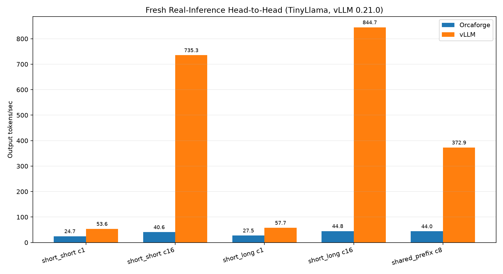

# Orcaforge (LLM Serving Runtime)

Python/PyTorch LLM serving prototype: OpenAI-compatible API → coordinator → continuous-batching worker, with paged KV, prefix cache, optional LoRA/spec/INT4. Built to measure systems choices honestly against vLLM — **not** to claim throughput wins.

Every number below is tied to a committed artifact under `bench/results/`. Where a result is negative or within measurement noise, it is reported as such.

## What this project is good for

- **Systems engineering under measurement discipline:** continuous batching, paged KV reliability, prefix-cache composition, ablation protocol with noise floors.
- **Honest negatives:** paged decode still loses vs dynamic KV; vLLM wins matched TinyLlama H2H; speculative decode is **1.18×** not 1.5×.

## Headline evidence (do not round favorably)

| Claim | Result | Caveat | Artifact |
|---|---|---|---|
| **Paged CB reliability (Phase 1)** | ma=8 continuous-batch split ownership fixed; live 32/32 success on repro | Throughput still loses vs contiguous | `ca17077`, `tests/test_paged_batch_membership.py` |
| **Prefix KV (dynamic)** | **+46.97%** (10.76 → 15.81 tok/s), hit rate **0.95** | Not a vLLM cross-system win | [`prefix_cache.json`](bench/results/prefix_cache.json) |
| **Paged + prefix composition** | Approach A: detached block snapshots + `BlockPagedCache` hydrate; live success **1.0**, hits **9** | Correctness gate, not a speedup | [`paged_prefix_verify.json`](bench/results/paged_prefix_verify.json) |
| **Paged vs dynamic cost** | Decode-heavy B=8 128/512: paged decode ~**3.28×** slower wall; loss is decode-dominated | Prefer `PHASE2_KV_BACKEND=dynamic` as default | [`paged_vs_dynamic_breakdown.json`](bench/results/paged_vs_dynamic_breakdown.json) |
| **Stable feature ablation** | CB within noise; paged/prefix **above_noise_loss** on decode-heavy protocol | Do not cite superseded single-shot tables | [`ablation_matrix.json`](bench/results/ablation_matrix.json) |
| **Multi-LoRA** | ≥3 adapters, no base reload; **−25%** vs base-only | Synthetic PEFT unless paths set | [`multi_lora.json`](bench/results/multi_lora.json) |
| **Speculative decode** | Wired + parity tests; **1.18×**, 62.5% accept | Below 1.5× target | [`spec-decode-comparison.json`](bench/results/spec-decode-comparison.json) |
| **INT4 AWQ** | Runs E2E; lower VRAM | Token agreement vs FP16 **0.17** | [`quantization_comparison.json`](bench/results/quantization_comparison.json) |
| **vs vLLM (TinyLlama)** | vLLM **wins every** matched throughput row (e.g. `short_short @ c16` **735** vs **41** tok/s) | TinyLlama `long_*` / `chat_multiturn` failed at 2048 ctx | `*-head-to-head-tonight.*` |
| **Qwen2 long/mixed/chat repair** | All measured rows **success_rate=1.0** on Orcaforge (`long_short`/`long_long` c1; `mixed` c1/c8; `chat_multiturn` c1/c4). Concurrent empty-stream bug fixed (UUID request ids). | WSL/vLLM out of scope on this host; chat c8 not claimed on 8GB laptop | [`orcaforge-qwen2-repair.csv`](bench/results/orcaforge-qwen2-repair.csv) |

### Synthetic MoE (not real MoE serving)

Toy routing only (`runtime/phase2/moe_primitive.py`). Artifact: [`moe-synthetic.json`](bench/results/moe-synthetic.json).

## Design
- [Design notes](docs/design.md) — iteration scheduling, paged KV, streaming retry, coordinator routing.
- ADRs under [`docs/adr/`](docs/adr/).
- Phase2 smoke: `python bench/scripts/continuous_batching_kv_live.py`
- Comparison chart: `python bench/scripts/plot_comparison.py` → `bench/results/comparison.png`



## Quickstart
```bash
python -m venv .venv311
.venv311\Scripts\activate
pip install -r requirements.txt   # plus torch CUDA build for GPU
python bench/harness/run.py --dry-run --scenarios bench/scenarios/baseline.yaml
```

Worker (GPU):
```bash
set PHASE2_BACKEND=transformers
set HF_MODEL_ID=Qwen/Qwen2-1.5B-Instruct
set HF_DEVICE=cuda
uvicorn runtime.phase2.worker_server:app --port 8102
```

## Benchmarks
- Harness: `bench/harness/run.py`
- Qwen2 repair (Orcaforge): `python scripts/run_orcaforge_qwen2_repair.py`
- Paged+prefix gate: `python bench/scripts/paged_prefix_verify.py`
- Prefill/decode breakdown: `python bench/scripts/paged_vs_dynamic_breakdown.py`

## Status
Phases 1–6 complete and pushed to `origin/main`. Story is Orcaforge systems work + honest measurement on Windows/RTX 5070. **WSL/vLLM is out of scope on this host.** Historical TinyLlama H2H artifacts remain for context; do not claim Orcaforge beats vLLM.
